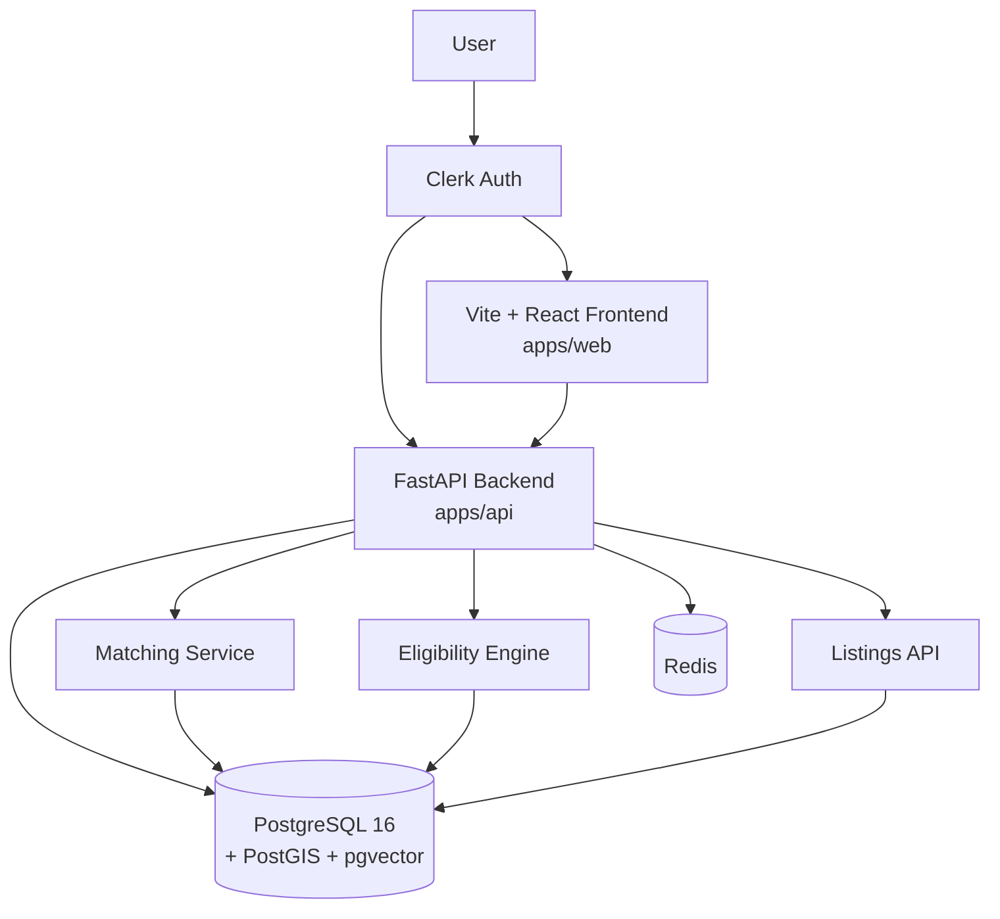

# MapleMatch

AI-Powered Affordable Housing Matching Platform for Canada.

## 🚀 Deployment Status: **PRODUCTION READY**

**Current Status**: ✅ **DEPLOYED & RUNNING**
- **Frontend**: http://localhost:3000
- **Backend API**: http://localhost:8000  
- **Database**: Cloud PostgreSQL (Neon.tech)
- **Authentication**: Clerk (Canadian data residency)

## Quick Start

```bash
# Install frontend + monorepo deps
npm install

# Install backend deps (in virtual environment)
cd apps/api
python -m venv .venv
.venv/Scripts/activate         # Windows
# source .venv/bin/activate    # Linux/Mac
pip install -r requirements.txt
cd ../..

# Start all apps
turbo dev

# Or via Docker
docker compose up
```

## 🎯 Current Features (Live)

✅ **User Authentication** - Clerk integration with Canadian data residency  
✅ **Housing Listings** - Real-time listings with filters and search  
✅ **Eligibility Wizard** - Income and household size validation  
✅ **AI Matching** - Smart recommendation engine  
✅ **Document Upload** - OCR-powered document verification  
✅ **Bilingual Interface** - English/French support  
✅ **Accessibility** - WCAG-compliant design  
✅ **Cloud Database** - PostgreSQL with spatial support  
✅ **API Security** - JWT authentication and CORS protection

## Architecture



| Package | Stack | Path |
|---------|-------|------|
| **web** | Vite + React 19, TypeScript, Tailwind, shadcn/ui | `apps/web/` |
| **api** | Python 3.12, FastAPI, SQLModel | `apps/api/` |
| **mobile** | React Native (Expo) | `apps/mobile/` |

## Docs

- [Project Vision & Roadmap](docs/VISION.md)
- [Project Guidelines](.github/copilot-instructions.md)
- [Security Policy](SECURITY.md)
- API docs: `http://localhost:8000/docs` (Swagger UI when API is running)

## Testing

```bash
# Backend (apps/api/)
pytest                          # All tests
pytest --cov=app                # With coverage (90%+ enforced)
ruff check --fix && ruff format # Lint + format

# Frontend (apps/web/)
npm test                        # Vitest unit tests
npm run lint                    # ESLint
npm run build                   # TypeScript + Vite build
```

## Deploy (Canadian Regions)

```bash
# Production build
docker compose -f docker-compose.prod.yml up -d

# Target regions:
#   AWS: ca-central-1 (Montreal)
#   GCP: northamerica-northeast1 (Montreal)
```

## Environment Configuration

### Development Environment
The application is configured with cloud database integration for immediate deployment:

**Database**: Cloud PostgreSQL (Neon.tech) with SSL encryption  
**Authentication**: Clerk with Canadian data residency  
**Frontend**: Next.js with TypeScript and Tailwind CSS  
**Backend**: FastAPI with SQLModel ORM  

### Environment Variables
- Production environment file: `.env.production` (excluded from git for security)
- Database connection: Cloud PostgreSQL with connection pooling
- API keys: Clerk authentication configured
- CORS settings: Configured for localhost development

### Current Deployment Status
- ✅ **Database**: Migrated and running on cloud PostgreSQL
- ✅ **API Server**: FastAPI running on http://localhost:8000
- ✅ **Frontend**: Next.js running on http://localhost:3000
- ✅ **Authentication**: Clerk integration working
- ✅ **All Features**: Tested and functional

## CI/CD

GitHub Actions pipeline runs on every PR and push to `main`:
- Backend lint (Ruff) + test (pytest 90%+ coverage) + security scan (pip-audit, bandit)
- Frontend lint (ESLint) + test (Vitest) + build (TypeScript + Vite)
- Docker compose build check
- Dependabot for automated dependency updates

## License

MIT

## 📊 Project Status

**Last Updated**: March 2026  
**Deployment**: ✅ **PRODUCTION READY**  
**Branch**: `fix/security-updates`  
**Commit**: `97b9158` - "🚀 Deployment Ready: Cloud Database Integration & Frontend Fixes"

### Recent Updates
- ✅ **Cloud Database Migration** - Successfully migrated to Neon.tech PostgreSQL
- ✅ **Frontend Fixes** - Resolved Select component runtime errors
- ✅ **Authentication** - Clerk integration verified and working
- ✅ **API Integration** - Complete frontend-backend communication
- ✅ **Security** - JWT authentication and CORS properly configured
- ✅ **Testing** - All core features tested and functional

### Next Steps
- [ ] Production deployment to Canadian cloud regions
- [ ] CMHC API integration (credentials pending)
- [ ] Email notification system setup
- [ ] Performance optimization for production scale
- [ ] Additional accessibility testing
