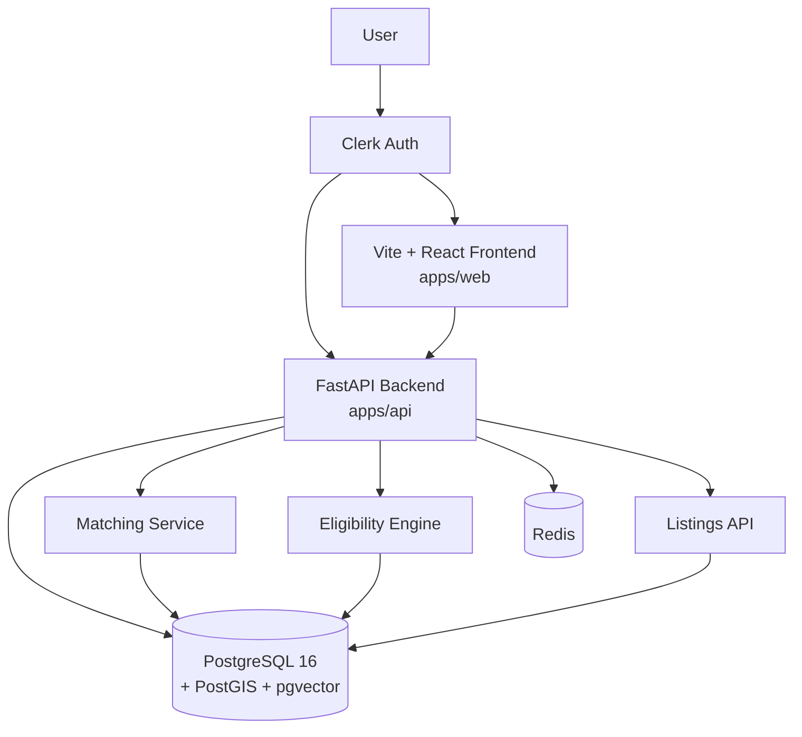

# MapleMatch

AI-Powered Affordable Housing Matching Platform for Canada.

## Quick Start

```bash
# Install frontend + monorepo deps
npm install

# Install backend deps (in virtual environment)
cd apps/api
python -m venv .venv
.venv/Scripts/activate         # Windows
# source .venv/bin/activate    # Linux/Mac
pip install -r requirements.txt
cd ../..

# Start all apps
turbo dev

# Or via Docker
docker compose up
```

## Architecture



| Package | Stack | Path |
|---------|-------|------|
| **web** | Vite + React 19, TypeScript, Tailwind, shadcn/ui | `apps/web/` |
| **api** | Python 3.12, FastAPI, SQLModel | `apps/api/` |
| **mobile** | React Native (Expo) | `apps/mobile/` |

## Docs

- [Project Vision & Roadmap](docs/VISION.md)
- [Project Guidelines](.github/copilot-instructions.md)
- [Security Policy](SECURITY.md)
- API docs: `http://localhost:8000/docs` (Swagger UI when API is running)

## Testing

```bash
# Backend (apps/api/)
pytest                          # All tests
pytest --cov=app                # With coverage (90%+ enforced)
ruff check --fix && ruff format # Lint + format

# Frontend (apps/web/)
npm test                        # Vitest unit tests
npm run lint                    # ESLint
npm run build                   # TypeScript + Vite build
```

## Deploy (Canadian Regions)

```bash
# Production build
docker compose -f docker-compose.prod.yml up -d

# Target regions:
#   AWS: ca-central-1 (Montreal)
#   GCP: northamerica-northeast1 (Montreal)
```

## CI/CD

GitHub Actions pipeline runs on every PR and push to `main`:
- Backend lint (Ruff) + test (pytest 90%+ coverage) + security scan (pip-audit, bandit)
- Frontend lint (ESLint) + test (Vitest) + build (TypeScript + Vite)
- Docker compose build check
- Dependabot for automated dependency updates

## License

MIT
